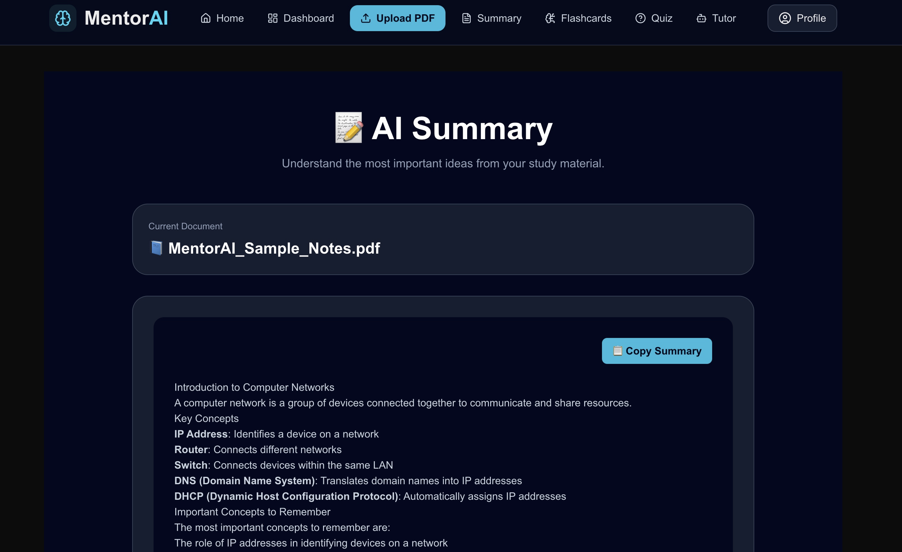
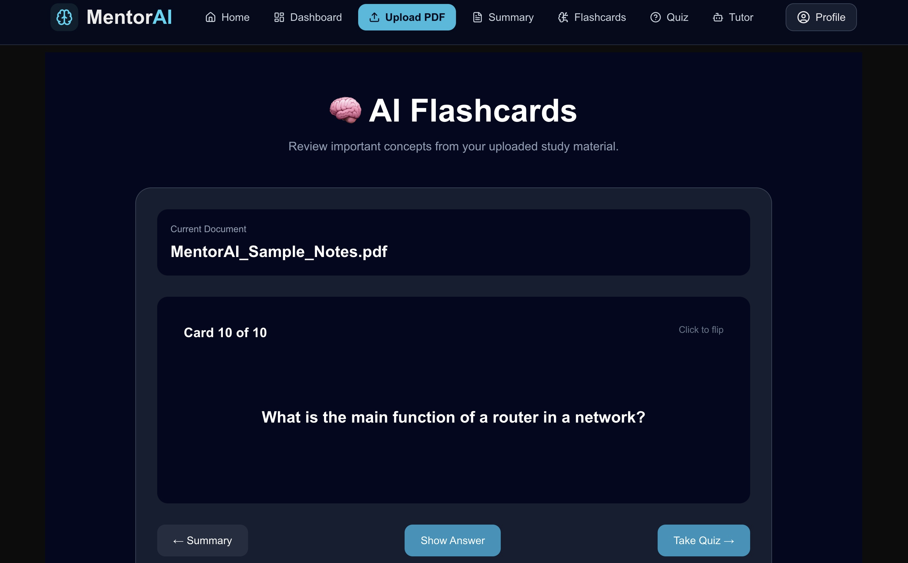
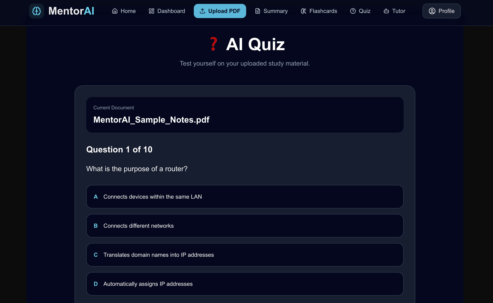
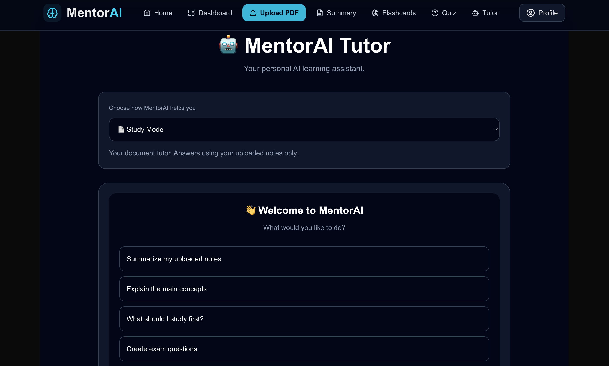

# 🧠 MentorAI

Transform PDFs into AI-powered summaries, flashcards, quizzes, and an AI tutor.

MentorAI is a modern AI study platform built with Next.js, TypeScript, Tailwind CSS, and Groq AI. Upload PDF notes to generate AI-powered summaries, flashcards, quizzes, and an AI tutor.

# 🌐 Live Demo

**Live Demo:** <https://mentor-ai-jet-seven.vercel.app>

# 📸 Screenshots

### 🏠 Home


### 📄 Upload PDF


### 📝 AI Summary


### 🧠 AI Flashcards


### ✅ AI Quiz


### 💬 AI Tutor



# ✨ Features

### 📄 PDF Upload
Upload PDF notes, textbooks, or study guides and let MentorAI analyze your study materials.

### 🤖 AI Tutor
Choose between three learning modes:

- **📄 Study Mode** – Answers questions using your uploaded notes.
- **🎓 Learn Mode** – Explains concepts step-by-step like a personal tutor.
- **💬 General AI** – Helps with writing, brainstorming, explanations, and everyday questions.

### 📝 AI Summaries
Generate concise, easy-to-understand summaries that highlight the most important concepts from your documents.

### 🧠 AI Flashcards
Create AI-generated flashcards to reinforce learning through active recall.

### ❓ AI Quizzes
Test your understanding with automatically generated multiple-choice quizzes based on your uploaded documents.

### 📊 Study Dashboard
View your current study session and navigate between learning tools.

### 👤 Profile
Access study information and learning statistics.


# 🛠 Tech Stack

| Category | Technologies |
|----------|--------------|
| Frontend | Next.js, React, TypeScript, Tailwind CSS |
| Artificial Intelligence | Groq API, Llama Models |
| Document Processing | PDF Text Extraction |
| Deployment | Vercel |
| Version Control | Git & GitHub |


# 🚀 Getting Started

Clone the repository:

```bash
git clone https://github.com/baleriaes/mentor-ai.git
```

Install dependencies:

```bash
npm install
```

Start the development server:

```bash
npm run dev
```

Open your browser and visit:

```
http://localhost:3000
```


# 📁 Project Structure

```
mentor-ai/
├── app/
├── components/
├── lib/
├── public/
├── styles/
└── README.md
```


# 🚀 Future Roadmap

- User authentication
- Cloud document storage
- Progress analytics
- AI study plans
- Multi-document conversations
- Spaced repetition learning
- Mobile optimization


# 👨‍💻 Author

**Baleria Estrada**

Built as a personal project to explore AI-powered education and create a smarter, more interactive way for students to study using modern web technologies.
